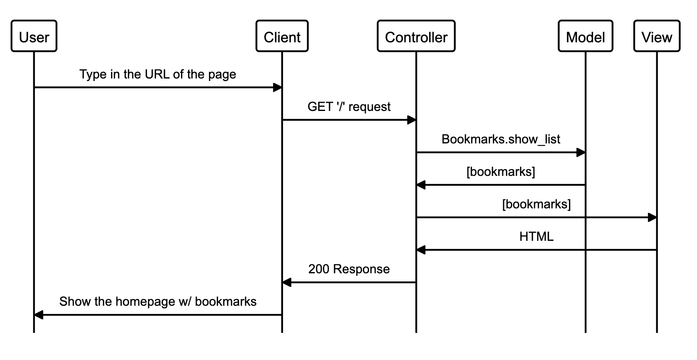

# Bookmark Manager

Build a web app that stores web bookmarks in a database.

## The project

Build a bookmark manager.  A bookmark manager is a website to maintain a collection of bookmarks (URLs). You can use it to save a webpage you found useful. You can add tags to the webpages you saved to find them later. You can browse bookmarks other users have added. You can comment on the bookmarks.

## How to use the program
### Cloning the repo & installing the necessary gems
```sh
$ git clone git@github.com:stringiest/bookmark_manager.git
$ cd rps-challenge
$ bundle
```
### Creating the database
1. Connect to `psql`
2. Create the database using the `psql` command `CREATE DATABASE bookmark_manager;`
3. Connect to the database using the `pqsl` command `\c bookmark_manager;`
4. Run the query we have saved in the file `01_create_bookmarks_table.sql`

### Setting up the test database
1. Connect to `psql`
2. Create the database using the `psql` command `CREATE DATABASE bookmark_manager_test;`
3. Connect to the database using the `pqsl` command `\c bookmark_manager_test;`
4. Run the query we have saved in the file `01_create_bookmarks_table.sql`

## Main focuses for this week

- Agile and TDD
- Engineering and 'Dev Recipes'
- Databases
- Tooling

## Specification
The website will have the following **specification**:

* Show a list of bookmarks
* Add new bookmarks
* Delete bookmarks
* Update bookmarks
* Comment on bookmarks
* Tag bookmarks into categories
* Filter bookmarks by tag
* Users are restricted to manage only their own bookmarks

## User stories

```
As a user, so that I can find my favourite websites, I want to be shown a list of bookmarks.
```


```
As a time-pressed user
So that I can quickly go to web sites I regularly visit
I would like to see a list of bookmarks
```

```
As a time-pressed user
So that I can save a website
I would like to add the site's address and title to bookmark manager
```
